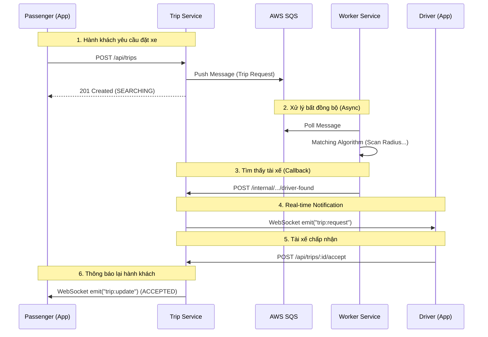

```mermaid
sequenceDiagram
    participant P as Passenger (App)
    participant T as Trip Service
    participant S as AWS SQS
    participant W as Worker Service
    participant D as Driver (App)

    Note over P,T: 1. Hành khách yêu cầu đặt xe
    P->>T: POST /api/trips
    T->>S: Push Message (Trip Request)
    T-->>P: 201 Created (SEARCHING)

    Note over S,W: 2. Xử lý bất đồng bộ (Async)
    W->>S: Poll Message
    W->>W: Matching Algorithm (Scan Radius...)

    Note over W,T: 3. Tìm thấy tài xế (Callback)
    W->>T: POST /internal/.../driver-found

    Note over T,D: 4. Real-time Notification
    T->>D: WebSocket emit("trip:request")

    Note over D,T: 5. Tài xế chấp nhận
    D->>T: POST /api/trips/:id/accept

    Note over T,P: 6. Thông báo lại hành khách
    T->>P: WebSocket emit("trip:update") (ACCEPTED)
```
