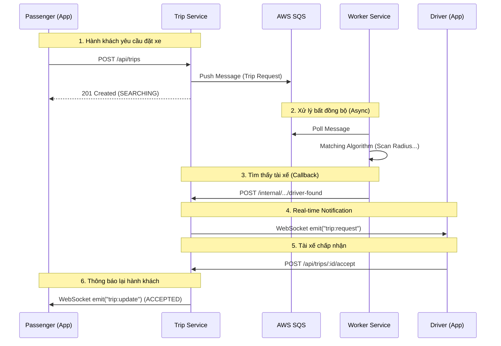

# Architecture Decision Records (ADR) - UIT-GO

> **Tài liệu ghi nhận các quyết định kiến trúc** của hệ thống UIT-GO.  
> Mỗi ADR mô tả một quyết định quan trọng, bối cảnh, các phương án đã xem xét, và lý do chọn phương án cuối cùng.

---

## Mục lục

- [ADR-001: Chọn kiến trúc Microservices](#adr-001-chọn-kiến-trúc-microservices)
- [ADR-002: Chọn ngôn ngữ và runtime](#adr-002-chọn-ngôn-ngữ-và-runtime)
- [ADR-003: Chiến lược Database-per-Service](#adr-003-chiến-lược-database-per-service)
- [ADR-004: Sử dụng Redis cho vị trí địa lý (Geospatial)](#adr-004-sử-dụng-redis-cho-vị-trí-địa-lý-geospatial)
- [ADR-005: Giao tiếp Service-to-Service bằng HTTP REST](#adr-005-giao-tiếp-service-to-service-bằng-http-rest)
- [ADR-006: Real-time Communication với WebSocket (Socket.io)](#adr-006-real-time-communication-với-websocket-socketio)
- [ADR-007: Xác thực và phân quyền bằng JWT](#adr-007-xác-thực-và-phân-quyền-bằng-jwt)
- [ADR-008: Containerization với Docker và Docker Compose](#adr-008-containerization-với-docker-và-docker-compose)
- [ADR-009: Xác thực email bằng OTP](#adr-009-xác-thực-email-bằng-otp)
- [ADR-010: Cơ chế Rematch khi tài xế từ chối hoặc timeout](#adr-010-cơ-chế-rematch-khi-tài-xế-từ-chối-hoặc-timeout)
- [ADR-011: Prisma ORM cho PostgreSQL](#adr-011-prisma-orm-cho-postgresql)
- [ADR-012: Monorepo Project Structure](#adr-012-monorepo-project-structure)

---

## ADR-001: Chọn kiến trúc Microservices

### Trạng thái
**Đã chấp nhận** (Accepted)

### Bối cảnh
Hệ thống UIT-GO là ứng dụng đặt xe (ride-hailing) với các chức năng chính:
- Quản lý người dùng (đăng ký, đăng nhập, xác thực)
- Quản lý vị trí tài xế (GPS tracking)
- Điều phối chuyến đi (booking, matching, state management)

Cần lựa chọn kiến trúc phù hợp để đáp ứng yêu cầu về:
- Khả năng mở rộng (scalability)
- Độc lập phát triển và triển khai
- Tách biệt domain nghiệp vụ

### Các phương án đã xem xét

| Phương án | Mô tả | Ưu điểm | Nhược điểm |
|-----------|-------|---------|------------|
| **Monolithic** | Một ứng dụng duy nhất | Đơn giản, dễ deploy | Khó scale riêng từng phần, tight coupling |
| **Microservices** | Chia thành các service độc lập | Scale độc lập, loose coupling | Phức tạp hơn, cần orchestration |
| **Serverless** | Functions-as-a-Service | Auto-scale, pay-per-use | Cold start, vendor lock-in |

### Quyết định
**Chọn kiến trúc Microservices** với 3 services chính:
1. **User Service** (Port 3000): Quản lý định danh và xác thực
2. **Driver Service** (Port 3001): Quản lý vị trí tài xế
3. **Trip Service** (Port 3002): Orchestrator, quản lý vòng đời chuyến đi và kết nối WebSocket.
4. **Worker Service** (BackGround): Xử lý các tác vụ tính toán nặng (Matching Algorithm).

### Lý do
1. **Tách biệt domain**: Mỗi service xử lý một miền nghiệp vụ cụ thể
2. **Scale độc lập**: Driver Service có thể scale riêng khi có nhiều cập nhật GPS
3. **Fault isolation**: Lỗi ở một service không ảnh hưởng trực tiếp đến các service khác
4. **Phù hợp học tập**: Giúp sinh viên hiểu cách thiết kế hệ thống phân tán

### Hệ quả
- (+) Các team có thể phát triển độc lập
- (+) Deploy và scale từng service riêng biệt
- (-) Tăng độ phức tạp về network và debugging
- (-) Cần xử lý distributed transactions

---

## ADR-002: Chọn ngôn ngữ và runtime

### Trạng thái
**Đã chấp nhận** (Accepted)

### Bối cảnh
Cần chọn ngôn ngữ lập trình và runtime cho backend services. Yêu cầu:
- Hỗ trợ tốt I/O operations (database, network)
- Dễ học và có ecosystem phong phú
- Phù hợp cho real-time applications

### Các phương án đã xem xét

| Phương án | Runtime | Ưu điểm | Nhược điểm |
|-----------|---------|---------|------------|
| **Node.js + JavaScript** | V8 | Dễ học, npm ecosystem | Không có type checking |
| **Node.js + TypeScript** | V8 | Type-safe, IntelliSense | Cần compile step |
| **Go** | Native | Performance cao, concurrency | Learning curve |
| **Python + FastAPI** | CPython | Dễ đọc, nhiều libraries | Slower than Node.js |

### Quyết định
**Chọn Node.js** với sự kết hợp:
- **User Service**: JavaScript (ES Modules)
- **Driver Service**: TypeScript
- **Trip Service**: TypeScript

### Lý do
1. **Non-blocking I/O**: Phù hợp với ứng dụng nhiều I/O operations
2. **Real-time support**: Socket.io tích hợp tốt với Node.js
3. **TypeScript cho critical services**: Driver và Trip services cần type safety vì logic phức tạp hơn
4. **Đồng nhất ecosystem**: Tất cả services dùng npm, dễ quản lý dependencies

### Hệ quả
- (+) Development nhanh với npm packages
- (+) Type safety cho các service quan trọng
- (-) TypeScript cần build step trước khi chạy
- (-) JavaScript thiếu type checking ở User Service

---

## ADR-003: Chiến lược Database-per-Service

### Trạng thái
**Đã chấp nhận** (Accepted)

### Bối cảnh
Với kiến trúc microservices, cần quyết định chiến lược quản lý database:
- Shared database (tất cả services dùng chung 1 database)
- Database-per-service (mỗi service có database riêng)

### Các phương án đã xem xét

| Phương án | Mô tả | Ưu điểm | Nhược điểm |
|-----------|-------|---------|------------|
| **Shared Database** | Một database chung | Đơn giản, JOIN dễ dàng | Tight coupling, bottleneck |
| **Database-per-Service** | Mỗi service có DB riêng | Loose coupling, scale riêng | Distributed transactions phức tạp |

### Quyết định
**Chọn Database-per-Service** với:
- **pg_user** (PostgreSQL): Cho User Service
- **pg_trip** (PostgreSQL): Cho Trip Service
- **Redis**: Shared cho OTP (User) và Geospatial (Driver)

### Lý do
1. **Loose coupling**: Services không phụ thuộc vào schema của nhau
2. **Independent scaling**: pg_trip có thể scale riêng nếu có nhiều trips
3. **Technology flexibility**: Có thể đổi database cho từng service nếu cần
4. **Fault isolation**: Database failure không ảnh hưởng đến service khác

### Hệ quả
- (+) Services có thể evolve schema độc lập
- (+) Không có single point of failure về database
- (-) Không thể JOIN trực tiếp giữa các database
- (-) Cần xử lý data consistency qua events hoặc API calls


---

## ADR-004: Sử dụng Redis cho vị trí địa lý (Geospatial)

### Trạng thái
**Đã chấp nhận** (Accepted)

### Bối cảnh
Driver Service cần:
- Lưu trữ vị trí GPS của tài xế (latitude, longitude)
- Tìm kiếm tài xế gần nhất trong một bán kính
- Cập nhật vị trí thường xuyên (mỗi vài giây)
- Quản lý trạng thái online/offline với TTL

### Các phương án đã xem xét

| Phương án | Mô tả | Ưu điểm | Nhược điểm |
|-----------|-------|---------|------------|
| **PostgreSQL + PostGIS** | SQL database với GIS extension | ACID, complex queries | Overhead cho writes thường xuyên |
| **MongoDB Geospatial** | Document DB với 2dsphere index | Flexible schema | Thêm một DB technology |
| **Redis Geospatial** | In-memory với GEOADD/GEOSEARCH | Extremely fast, TTL support | Data not persistent by default |
| **Elasticsearch** | Search engine với geo_point | Powerful search | Overkill cho use case đơn giản |

### Quyết định
**Chọn Redis Geospatial** với các commands:
- `GEOADD drivers:locations <lng> <lat> <driverId>`: Thêm/cập nhật vị trí
- `GEOSEARCH drivers:locations FROMMEMBER <id> BYRADIUS <km> km`: Tìm tài xế gần nhất
- `SETEX driver:status:<id> <TTL> ONLINE`: Quản lý trạng thái với auto-expire

### Lý do
1. **Performance**: In-memory, latency < 1ms cho geo queries
2. **Built-in TTL**: Tự động xóa tài xế offline sau một thời gian
3. **Simplicity**: Không cần thêm database technology
4. **Ephemeral data**: Vị trí tài xế là dữ liệu tạm thời, mất đi khi restart cũng không sao

### Hệ quả
- (+) Response time cực nhanh cho việc tìm tài xế
- (+) Tự động cleanup với TTL
- (+) Đã dùng Redis cho OTP, không cần thêm infrastructure
- (-) Data mất khi Redis restart (acceptable cho vị trí tài xế)
- (-) Giới hạn memory nếu có nhiều tài xế

---

## ADR-005: Giao tiếp Hybrid (REST API & SQS)

### Trạng thái
**Đã chấp nhận** (Accepted)

### Bối cảnh
Các service cần giao tiếp với nhau. Có 2 lựa chọn chính cho giao tiếp đồng bộ: gRPC và REST API. Ngoài ra cần cơ chế bất đồng bộ cho tác vụ nặng.

Cần chọn cơ chế giao tiếp phù hợp.

### Các phương án đã xem xét

| Phương án | Mô tả | Ưu điểm | Nhược điểm |
|-----------|-------|---------|------------|
| **HTTP REST (Sync)** | Gọi HTTP trực tiếp | Đơn giản, debugging dễ | Tight coupling về availability |
| **gRPC** | RPC với Protocol Buffers | Performance cao, type-safe | Cần proto files, complexity |
| **Message Queue** | Async via RabbitMQ/Kafka | Decoupled, reliable | Eventual consistency, complex |
| **GraphQL Federation** | Unified API gateway | Single endpoint | Overkill cho 3 services |

### Quyết định
**Sử dụng mô hình hydrid** 
1. **REST API**: Cho giao tiếp đồng bộ giữa các service (VD: Trip gọi User).
2. **AWS SQS**: Cho giao tiếp bất đồng bộ (Trip đẩy việc cho Worker).

### Lý do
Với nguồn lực nhóm chỉ có 2 thành viên, nhóm ưu tiên tốc độ phát triển (Development Velocity) và sự đơn giản (Simplicity) hơn là sự tối ưu vi mô về băng thông mạng:

1. **Chi phí vận hành & Học tập**: gRPC yêu cầu quản lý file .proto chung, versioning, và quy trình CI/CD để generate code cho cả 2 phía Client/Server. Với 2 người, việc này tạo ra "overhead" không đáng có. REST tận dụng kiến thức sẵn có, không tốn thời gian đào tạo.
2. **Khả năng Debug**: Khi hệ thống gặp lỗi, việc có thể dùng Postman hoặc console.log JSON object giúp tìm lỗi nhanh hơn nhiều so với việc giải mã binary của gRPC.
3. **Hiệu năng**: Nút thắt cổ chai **(Bottleneck)** của hệ thống nằm ở Database I/O và Thuật toán Matching, không phải ở việc serialize JSON. Việc dùng REST là "đủ tốt" (Good enough). Hiệu năng cao đã được giải quyết bằng việc offload tác vụ nặng sang SQS và Worker Service.

### Hệ quả
- (+) Đơn giản, dễ hiểu và debug
- (+) Không cần thêm infrastructure (message broker)
- (-) Trip Service phụ thuộc vào Driver Service availability
- (-) Nếu Driver Service down, Trip Service sẽ fail

### Mitigation cho nhược điểm
- Thêm retry logic với exponential backoff
- Circuit breaker pattern (future improvement)
- Health check endpoints

---

## ADR-006: Real-time Communication với WebSocket (Socket.io)

### Trạng thái
**Đã chấp nhận** (Accepted)

### Bối cảnh
Ứng dụng cần thông báo real-time cho:
- Tài xế: Nhận yêu cầu chuyến đi mới
- Hành khách: Cập nhật trạng thái chuyến đi (tài xế chấp nhận, đang đến, hoàn thành)

### Các phương án đã xem xét

| Phương án | Mô tả | Ưu điểm | Nhược điểm |
|-----------|-------|---------|------------|
| **HTTP Polling** | Client poll server định kỳ | Đơn giản | Tốn bandwidth, không thực sự real-time |
| **Server-Sent Events (SSE)** | Server push events | Nhẹ, HTTP-based | Chỉ one-way communication |
| **WebSocket (Socket.io)** | Bi-directional, persistent | Real-time, rooms support | Stateful, scale khó hơn |
| **Firebase/Pusher** | Managed real-time service | Easy setup | Vendor lock-in, cost |

### Quyết định
**Chọn Socket.io** (WebSocket wrapper) cho Trip Service.

### Lý do
1. **Bi-directional**: Cả client và server có thể gửi message
2. **Rooms support**: Dễ dàng gửi message đến một user cụ thể (`user_{id}` room)
3. **Fallback**: Socket.io tự động fallback về polling nếu WebSocket không được hỗ trợ
4. **Node.js integration**: Tích hợp tốt với Express

### Hệ quả
- (+) Real-time notifications cho cả tài xế và hành khách
- (+) Rooms giúp target message chính xác
- (-) Stateful connections, khó scale horizontally
- (-) Cần JWT authentication cho WebSocket connections

### Implementation

```typescript
// Server - Gửi yêu cầu chuyến mới đến tài xế
io.to(`user_${driverId}`).emit('trip:request', tripData);

// Server - Thông báo trạng thái cho hành khách
io.to(`user_${passengerId}`).emit('trip:update', { status: 'ACCEPTED' });

// Client - Kết nối với authentication
const socket = io(TRIP_SERVICE_URL, {
  auth: { token: jwtToken }
});
```

### Event Flow

```
┌────────────┐         ┌──────────────┐         ┌────────────┐
│  Passenger │         │ Trip Service │         │   Driver   │
└─────┬──────┘         └──────┬───────┘         └─────┬──────┘
      │                       │                       │
      │ POST /trips           │                       │
      │──────────────────────►│                       │
      │                       │                       │
      │                       │  emit('trip:request') │
      │                       │──────────────────────►│
      │                       │                       │
      │                       │   POST /trips/accept  │
      │                       │◄──────────────────────│
      │                       │                       │
      │  emit('trip:update')  │                       │
      │◄──────────────────────│                       │
      │    {status:ACCEPTED}  │                       │
```

---




## ADR-007: Xác thực và phân quyền bằng JWT

### Trạng thái
**Đã chấp nhận** (Accepted)

### Bối cảnh
Cần cơ chế xác thực người dùng cho:
- API calls từ mobile app
- WebSocket connections
- Phân biệt role (PASSENGER, DRIVER, ADMIN)

### Các phương án đã xem xét

| Phương án | Mô tả | Ưu điểm | Nhược điểm |
|-----------|-------|---------|------------|
| **Session-based** | Server lưu session | Dễ revoke | Stateful, khó scale |
| **JWT (JSON Web Token)** | Token chứa claims | Stateless, self-contained | Khó revoke, token size |
| **OAuth 2.0 + OIDC** | Delegation với identity provider | Standard, secure | Complex setup |
| **API Keys** | Static keys per user | Simple | Không có expiration |

### Quyết định
**Chọn JWT** với:
- **Access Token**: Short-lived (15 phút - 1 giờ)
- **Refresh Token**: Long-lived, lưu trong database
- **Claims**: userId, email, role

### Lý do
1. **Stateless**: Không cần lookup database cho mỗi request
2. **Cross-service**: Các service khác có thể verify token với shared secret
3. **Claims-based**: Dễ dàng kiểm tra role (PASSENGER vs DRIVER)
4. **Mobile-friendly**: Phù hợp với mobile app authentication

### Hệ quả
- (+) Performance tốt, không cần session lookup
- (+) Các services có thể verify token độc lập
- (-) Không thể revoke token ngay lập tức
- (-) Token size lớn hơn session ID

### Token Structure

```json
// JWT Payload
{
  "sub": "123",           // User ID
  "email": "user@example.com",
  "role": "DRIVER",
  "iat": 1699000000,      // Issued at
  "exp": 1699003600       // Expires (1 hour)
}
```

### Usage Flow

```
┌────────┐     ┌──────────────┐     ┌──────────────┐
│ Client │     │ User Service │     │ Trip Service │
└───┬────┘     └──────┬───────┘     └──────┬───────┘
    │                 │                    │
    │ POST /auth/login                     │
    │────────────────►│                    │
    │                 │                    │
    │ { accessToken } │                    │
    │◄────────────────│                    │
    │                 │                    │
    │ POST /trips (Bearer token)           │
    │─────────────────────────────────────►│
    │                 │                    │
    │                 │   Verify JWT       │
    │                 │   (using secret)   │
    │                 │                    │
    │ { trip data }   │                    │
    │◄─────────────────────────────────────│
```

---

## ADR-008: Containerization với Docker và Docker Compose

### Trạng thái
**Đã chấp nhận** (Accepted)

### Bối cảnh
Cần đóng gói và chạy hệ thống với nhiều services và databases:
- 3 application services
- 2 PostgreSQL instances
- 1 Redis instance

### Các phương án đã xem xét

| Phương án | Mô tả | Ưu điểm | Nhược điểm |
|-----------|-------|---------|------------|
| **Chạy trực tiếp** | npm start, postgres local | Simple | "Works on my machine" |
| **Docker Compose** | Multi-container orchestration | Reproducible, isolated | Cần Docker installed |
| **Kubernetes** | Container orchestration platform | Production-grade | Overkill cho development |
| **Vagrant + VMs** | Full VM isolation | Complete isolation | Heavy, slow |

### Quyết định
**Chọn Docker + Docker Compose** với:
- Mỗi service có Dockerfile riêng
- `docker-compose.yml` định nghĩa tất cả services và networks

### Lý do
1. **Reproducibility**: "Works everywhere", đảm bảo môi trường giống nhau
2. **Isolation**: Mỗi service chạy trong container riêng
3. **Easy setup**: `docker-compose up -d` để start toàn bộ hệ thống
4. **Development-friendly**: Phù hợp cho local development và demo

### Hệ quả
- (+) Dễ setup và share môi trường development
- (+) Health checks và dependency management
- (+) Persistent volumes cho databases
- (-) Cần Docker Desktop (có thể nặng trên máy yếu)

### Docker Compose Structure

```yaml
services:
  # Application Services
  user-service:
    build: ./services/user-service
    ports: ["3000:3000"]
    depends_on: [pg_user, redis]
    
  driver-service:
    build: ./services/driver-service
    ports: ["3001:3001"]
    depends_on: [redis]
    
  trip-service:
    build: ./services/trip-service
    ports: ["3002:3002"]
    depends_on: [pg_trip, driver-service, redis]

  # Databases
  pg_user:
    image: postgres:16-alpine
    
  pg_trip:
    image: postgres:16-alpine
    
  redis:
    image: redis:7-alpine

volumes:
  pg_user_data:
  pg_trip_data:
  redis_data:
```

---

## ADR-009: Xác thực email bằng OTP

### Trạng thái
**Đã chấp nhận** (Accepted)

### Bối cảnh
Cần xác thực email của người dùng khi đăng ký để:
- Đảm bảo email thật và người dùng có quyền truy cập
- Ngăn chặn spam registration
- Cho phép recovery/reset password sau này

### Các phương án đã xem xét

| Phương án | Mô tả | Ưu điểm | Nhược điểm |
|-----------|-------|---------|------------|
| **Magic Link** | Email chứa link verify | UX tốt | Link có thể bị share |
| **OTP (One-Time Password)** | Mã 6 số gửi qua email | Simple, mobile-friendly | User phải nhập manual |
| **OAuth** | Đăng nhập qua Google/Facebook | Không cần verify | Phụ thuộc third-party |
| **SMS OTP** | Mã gửi qua SMS | Phổ biến | Tốn phí SMS |

### Quyết định
**Chọn Email OTP** với:
- Mã 6 chữ số ngẫu nhiên
- TTL: 5 phút
- Lưu trong Redis với key `otp:{email}`
- Giới hạn số lần gửi (rate limiting)

### Lý do
1. **Simple UX**: User chỉ cần nhập 6 số
2. **No cost**: Email miễn phí (dùng Gmail SMTP)
3. **Mobile-friendly**: Dễ dàng nhập OTP trên mobile
4. **Secure**: Mã ngắn hạn, auto-expire

### Hệ quả
- (+) Không tốn phí SMS
- (+) OTP tự động hết hạn trong Redis
- (+) Rate limiting ngăn spam
- (-) Email có thể đi vào spam folder
- (-) UX không tốt bằng magic link

### Flow

```
┌────────┐     ┌──────────────┐     ┌───────┐     ┌───────────┐
│ Client │     │ User Service │     │ Redis │     │   Email   │
└───┬────┘     └──────┬───────┘     └───┬───┘     └─────┬─────┘
    │                 │                 │               │
    │ POST /register  │                 │               │
    │────────────────►│                 │               │
    │                 │                 │               │
    │                 │ Generate OTP    │               │
    │                 │────────────────►│               │
    │                 │ SETEX otp:email │               │
    │                 │                 │               │
    │                 │ Send email      │               │
    │                 │────────────────────────────────►│
    │                 │                 │               │
    │ { success }     │                 │               │
    │◄────────────────│                 │               │
    │                 │                 │               │
    │ POST /verify-email (otp: 123456)  │               │
    │────────────────►│                 │               │
    │                 │ GET otp:email   │               │
    │                 │────────────────►│               │
    │                 │                 │               │
    │                 │ Compare & Verify│               │
    │                 │                 │               │
    │ { accessToken } │                 │               │
    │◄────────────────│                 │               │
```

---

## ADR-010: Cơ chế Rematch khi tài xế từ chối hoặc timeout

### Trạng thái
**Đã chấp nhận** (Accepted)

### Quyết định
Logic Rematch được xử lý phối hợp giữa Trip Service và Worker Service theo luồng:
1. Khi tài xế từ chối (`/reject`) hoặc hết thời gian, Trip Service ghi nhận vào bảng `TripRejectedDriver`.
2. Trip Service gửi một message mới vào **SQS** kèm theo danh sách `excludeDriverIds` (những tài xế đã từ chối).
3. Worker Service nhận message, thực hiện lại việc tìm kiếm, tự động loại trừ các ID trong danh sách đen.

### Lý do
Đảm bảo luồng tìm kiếm không bao giờ bị chặn (non-blocking) và logic phức tạp của việc rematch được tách biệt khỏi luồng xử lý HTTP chính.

---

### Hệ quả
- (+) UX tốt cho tài xế (không bị spam)
- (+) Theo dõi được pattern từ chối
- (-) Có thể mất thời gian nếu nhiều tài xế từ chối
- (-) Cần xử lý timeout carefully

### State Machine

```
                    ┌─────────────┐
                    │  SEARCHING  │
                    └──────┬──────┘
                           │ Found driver
                           ▼
                    ┌─────────────┐
        ┌──────────│DRIVER_FOUND │──────────┐
        │          └──────┬──────┘          │
        │                 │                 │
   Reject/Timeout      Accept           Cancel
        │                 │                 │
        │                 ▼                 │
        │          ┌─────────────┐          │
        │          │  ACCEPTED   │          │
        │          └─────────────┘          │
        │                                   │
        └─────────────┐                     │
                      ▼                     ▼
              ┌──────────────┐      ┌──────────────┐
              │  Try Next    │      │  CANCELLED   │
              │   Driver     │      └──────────────┘
              └──────┬───────┘
                     │
                     ▼
              (Back to SEARCHING with excludeIds)
```

### Database Schema

```sql
-- Bảng lưu trữ các tài xế đã từ chối
CREATE TABLE trip_rejected_drivers (
  id         SERIAL PRIMARY KEY,
  trip_id    TEXT NOT NULL,
  driver_id  INT NOT NULL,
  created_at TIMESTAMP DEFAULT NOW(),
  UNIQUE(trip_id, driver_id)
);
```

---

## ADR-011: Prisma ORM cho PostgreSQL

### Trạng thái
**Đã chấp nhận** (Accepted)

### Bối cảnh
User Service và Trip Service cần tương tác với PostgreSQL. Cần chọn cách tiếp cận:
- Raw SQL queries
- Query builder
- Full ORM

### Các phương án đã xem xét

| Phương án | Mô tả | Ưu điểm | Nhược điểm |
|-----------|-------|---------|------------|
| **Raw SQL (pg)** | Viết SQL trực tiếp | Full control | Verbose, SQL injection risk |
| **Knex.js** | Query builder | Flexible, migrations | Không có type-safe |
| **Prisma** | Modern ORM | Type-safe, schema-first | Learning curve |
| **TypeORM** | Decorator-based ORM | Feature-rich | Complex configuration |
| **Sequelize** | Traditional ORM | Mature | Verbose, callback-based |

### Quyết định
**Chọn Prisma** với:
- Schema-first approach (`schema.prisma`)
- Auto-generated Prisma Client
- Database migrations

### Lý do
1. **Type-safe**: Generated client có TypeScript types
2. **Schema-first**: Single source of truth cho database schema
3. **Migrations**: Version control cho database changes
4. **Developer experience**: IntelliSense, auto-completion
5. **Modern**: Active development, good documentation

### Hệ quả
- (+) Type-safe database operations
- (+) Dễ dàng refactor schema
- (+) Migrations tự động generate
- (-) Build step (prisma generate)
- (-) Một số advanced queries khó viết

### Example

```prisma
// schema.prisma
model User {
  id        Int      @id @default(autoincrement())
  email     String   @unique
  password  String
  name      String?
  role      Role     @default(PASSENGER)
  isVerified Boolean @default(false)
  
  @@map("users")
}

enum Role {
  PASSENGER
  DRIVER
  ADMIN
}
```

```typescript
// Usage with type-safety
const user = await prisma.user.create({
  data: {
    email: "test@example.com",
    password: hashedPassword,
    role: "DRIVER"  // TypeScript enforces valid enum
  }
});
```

---

## ADR-012: Monorepo Project Structure

### Trạng thái
**Đã chấp nhận** (Accepted)

### Bối cảnh
Với 3 microservices, cần quyết định cách tổ chức source code:
- Một repository cho mỗi service (polyrepo)
- Một repository chung cho tất cả (monorepo)

### Các phương án đã xem xét

| Phương án | Mô tả | Ưu điểm | Nhược điểm |
|-----------|-------|---------|------------|
| **Polyrepo** | Mỗi service một repo | Isolated, independent versioning | Khó coordinate changes |
| **Monorepo** | Tất cả trong một repo | Atomic changes, shared config | Có thể trở nên lớn |

### Quyết định
**Chọn Monorepo** với cấu trúc:

```
uit-go/
├── docker-compose.yml
├── README.md
├── ARCHITECTURE.md
├── BAOCAO.md
├── docs/
│   ├── ADR.md
│   └── images/
├── infra/
│   └── *.tf (Terraform)
└── services/
    ├── user-service/
    ├── driver-service/
    ├── trip-service/
    └── trip-service/
```

### Lý do
1. **Single source of truth**: Một repo dễ quản lý
2. **Atomic changes**: Có thể commit changes across services cùng lúc
3. **Shared docker-compose**: Dễ dàng start toàn bộ hệ thống
4. **Simplified CI/CD**: Một pipeline có thể build tất cả
5. **Phù hợp quy mô**: 3 services chưa đủ lớn để cần polyrepo

### Hệ quả
- (+) Dễ dàng coordinate changes giữa services
- (+) Shared documentation và infrastructure code
- (+) Simplified onboarding cho team members
- (-) Có thể trở nên lớn nếu thêm nhiều services
- (-) Không có isolated versioning per service

---
## ADR-013: Xử lý Bất đồng bộ với Worker Service & SQS (Module A)

### Trạng thái
**Đã chấp nhận** (Accepted) - *Đây là quyết định cốt lõi của Module A*

### Bối cảnh
Thuật toán tìm kiếm tài xế (`Matching Algorithm`) là tác vụ tốn kém:
1. Cần quét mở rộng bán kính (1km -> 3km -> 5km).
2. Phải gọi Driver Service nhiều lần và lọc kết quả.
3. Nếu thực hiện đồng bộ trong request `POST /trips`, HTTP connection sẽ bị treo (timeout) hoặc latency rất cao khi hệ thống tải lớn.

### Các phương án đã xem xét
| Phương án | Mô tả | Ưu điểm | Nhược điểm |
|-----------|-------|---------|------------|
| **Synchronous** | Xử lý ngay trong API | Đơn giản | Chặn request, khó scale, trải nghiệm người dùng kém |
| **Cron Job** | Quét DB định kỳ | Decoupled | Độ trễ cao (không real-time) |
| **Message Queue** | Offload sang Worker | High Scalability, Low Latency, Resilience | Phức tạp triển khai |

### Quyết định
Sử dụng **AWS SQS** kết hợp với **Worker Service**.

### Cách hoạt động
1. **Trip Service**: Nhận request -> Lưu trạng thái `SEARCHING` -> Bắn event vào SQS -> Trả về `201 Created` ngay lập tức.
2. **Worker Service**: Poll message từ SQS -> Thực hiện logic tìm kiếm phức tạp -> Gọi webhook nội bộ (`internal/driver-found`) của Trip Service để cập nhật kết quả.

### Hệ quả
- (+) **High Throughput**: Trip Service có thể nhận hàng ngàn request/giây mà không bị nghẽn.
- (+) **Resilience**: Nếu Worker chết hoặc quá tải, message vẫn nằm trong Queue, không bị mất yêu cầu đặt xe.
- (+) **Scalability**: Dễ dàng scale số lượng Worker instances dựa trên độ dài hàng đợi SQS (Auto-scaling).
- (-) **Complexity**: Cần quản lý thêm thành phần SQS và Worker Service.
---
## ADR-014: Chiến lược mở rộng Database (Read Replicas)

### Trạng thái
**Đã chấp nhận**

### Bối cảnh
`User Service` và `Trip Service` chịu tải Đọc (Read) nhiều hơn Ghi (Write) (tỷ lệ 80/20). Việc dồn tất cả query vào một DB instance duy nhất sẽ tạo nút thắt cổ chai.

### Các lựa chọn đã cân nhắc
1.  **Vertical Scaling (Scale Up):** Tăng CPU/RAM cho DB. -> *Tốn kém và có giới hạn vật lý.*
2.  **Caching (Redis):** Cache dữ liệu hay đọc. -> *Tốt, nhưng vẫn cần giải pháp cho các query phức tạp không cache được.*
3.  **Read Replicas (Scale Out):** Tạo bản sao DB chỉ để đọc.

### Quyết định
Sử dụng **PostgreSQL Read Replicas** kết hợp với **Prisma Read Replicas Extension**.
- **Primary DB:** Xử lý `INSERT`, `UPDATE`, `DELETE`.
- **Replica DB:** Xử lý `SELECT`.
- Cấu hình tự động định tuyến query ngay trong code `prisma.client.ts`.

### Phân tích Trade-off
* **Được (Pros):**
    * **Load Balancing:** Giảm tải đáng kể cho Primary DB.
    * **High Availability:** Nếu Primary chết, có thể promote Replica lên thay thế.
* **Mất (Cons):**
    * **Replication Lag:** Dữ liệu ở Replica có thể chậm hơn Primary vài mili-giây. *Chấp nhận được với nghiệp vụ xem lịch sử chuyến đi/profile.*
    * **Cost:** Tăng chi phí hạ tầng (thêm instance RDS).

---
