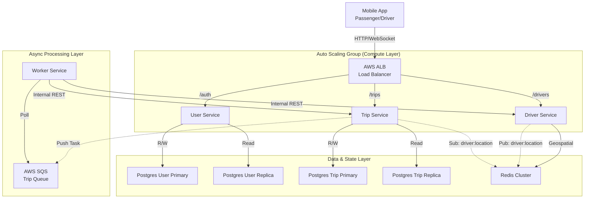

# Báo cáo Kiến trúc và Triển khai Hệ thống UIT-GO

## 1. Tổng quan Kiến trúc Hệ thống

UIT-GO được thiết kế dựa trên kiến trúc Microservices hiện đại, hướng tới khả năng mở rộng (Scalability), tính sẵn sàng cao (High Availability) và tối ưu hóa cho các tác vụ thời gian thực. Hệ thống được triển khai trên hạ tầng AWS (Amazon Web Services), sử dụng Docker để đóng gói ứng dụng và Terraform để quản lý cơ sở hạ tầng dưới dạng mã (IaC).

### Sơ đồ luồng dữ liệu

Hệ thống bao gồm 4 dịch vụ cốt lõi:

- **User Service**: Quản lý định danh, xác thực người dùng và phương tiện.
- **Driver Service**: Chuyên biệt cho việc quản lý vị trí địa lý (Geospatial) và trạng thái tài xế với độ trễ thấp bằng Redis.
- **Trip Service**: Đóng vai trò điều phối trung tâm, quản lý vòng đời chuyến đi và kết nối thời gian thực với người dùng.
- **Worker Service**: Dịch vụ chạy nền xử lý các thuật toán tìm kiếm tài xế phức tạp thông qua hàng đợi SQS.

## 2. Phân tích Module Chuyên sâu

### 2.1. Module Tìm kiếm & Ghép đôi (Matching Algorithm) - Asynchronous

Đây là "trái tim" của hệ thống, nơi chúng tôi đã chuyển đổi từ mô hình xử lý đồng bộ sang bất đồng bộ để giải quyết bài toán hiệu năng cao.

**Cách tiếp cận:** Thay vì xử lý logic tìm kiếm ngay khi nhận API `POST /trips` (điều này sẽ làm treo kết nối của người dùng), Trip Service chỉ thực hiện việc ghi nhận yêu cầu và đẩy một thông điệp (message) vào hàng đợi AWS SQS. Worker Service hoạt động độc lập sẽ liên tục "lắng nghe" (poll) hàng đợi này. Khi nhận được yêu cầu, Worker sẽ thực hiện thuật toán quét mở rộng bán kính (ví dụ: tìm trong 1km, nếu không thấy thì mở rộng ra 3km, 5km...) bằng cách gọi sang Driver Service. Kết quả tìm kiếm sẽ được Worker gửi ngược lại Trip Service thông qua Webhook nội bộ để cập nhật trạng thái và thông báo tới người dùng.

**Kết quả:** Kiến trúc này giúp Trip Service có thể tiếp nhận hàng nghìn yêu cầu đặt xe mỗi giây mà không bị quá tải. Việc tách rời logic tìm kiếm sang Worker giúp hệ thống dễ dàng mở rộng (scale) số lượng Worker khi nhu cầu đặt xe tăng cao mà không ảnh hưởng đến các dịch vụ khác.

### 2.2. Module Theo dõi Vị trí Thời gian thực (Real-time Tracking)

Module này đảm bảo hành khách có thể nhìn thấy vị trí tài xế di chuyển mượt mà trên bản đồ.

**Cách tiếp cận:** Chúng tôi sử dụng mô hình Pub/Sub của Redis kết hợp với Socket.io. Khi tài xế gửi toạ độ lên Driver Service (tần suất cao, vd: 5s/lần), Driver Service không chỉ lưu vào Redis Geo mà còn "phát sóng" (Publish) toạ độ này vào một kênh Redis chuyên biệt. Trip Service đăng ký (Subscribe) kênh này để nhận dữ liệu và đẩy xuống ứng dụng của hành khách thông qua kết nối WebSocket.

**Kết quả:** Giải pháp này giảm thiểu đáng kể độ trễ so với việc Client phải liên tục gọi API để lấy vị trí (Polling), đồng thời giảm tải cho Database vì toàn bộ luồng dữ liệu vị trí đều được xử lý trên bộ nhớ (In-memory).

## 3. Tổng hợp Các quyết định thiết kế và Trade-off

Phần này phân tích chi tiết các lựa chọn kỹ thuật quan trọng nhất, lý do lựa chọn và những sự đánh đổi mà nhóm đã chấp nhận để xây dựng hệ thống.

### 3.1. Lựa chọn Kiến trúc Microservices

Chúng tôi quyết định chia tách hệ thống thành các dịch vụ nhỏ (User, Driver, Trip, Worker) thay vì xây dựng một khối thống nhất (Monolith).

**Lý do lựa chọn:** Quyết định này xuất phát từ nhu cầu mở rộng linh hoạt. Ví dụ, dịch vụ Driver Service cần xử lý lượng ghi dữ liệu vị trí cực lớn và cần mở rộng độc lập so với User Service chủ yếu là các thao tác đọc. Ngoài ra, việc tách biệt giúp các module nghiệp vụ không bị ảnh hưởng chéo khi có lỗi xảy ra.

**Sự đánh đổi (Trade-off):** Cái giá phải trả là sự phức tạp trong vận hành và triển khai. Chúng tôi phải quản lý nhiều container, cấu hình mạng giữa các service phức tạp hơn và đối mặt với thách thức về tính nhất quán dữ liệu phân tán (distributed data consistency).

### 3.2. Chiến lược Database-per-Service

Mỗi dịch vụ sở hữu một cơ sở dữ liệu riêng biệt (`pg_user`, `pg_trip`, Redis Cluster) thay vì dùng chung một Database khổng lồ.

**Lý do lựa chọn:** Để đảm bảo tính lỏng lẻo (loose coupling). Nếu User Service bị quá tải hoặc Database của nó gặp sự cố, Trip Service vẫn có thể hoạt động (ví dụ: vẫn xử lý được các chuyến đi đang diễn ra). Điều này cũng cho phép chúng tôi chọn công nghệ lưu trữ phù hợp nhất cho từng nghiệp vụ (Redis cho vị trí, Postgres cho giao dịch).

**Sự đánh đổi (Trade-off):** Chúng tôi mất đi khả năng thực hiện các câu lệnh JOIN bảng giữa các domain khác nhau. Việc tổng hợp dữ liệu (ví dụ: xem lịch sử chuyến đi kèm thông tin chi tiết tài xế) đòi hỏi phải thực hiện các lệnh gọi API nội bộ để ghép dữ liệu, điều này làm tăng nhẹ độ trễ và phức tạp hóa code ở tầng Application.

### 3.3. Sử dụng Redis cho Dữ liệu Địa lý (Geospatial)

Thay vì sử dụng PostGIS (Extension của PostgreSQL), chúng tôi chọn Redis để lưu trữ và truy vấn vị trí tài xế.

**Lý do lựa chọn:** Yếu tố tiên quyết là tốc độ. Redis hoạt động trên RAM (In-memory), cho phép thực hiện các truy vấn không gian (như tìm tài xế trong bán kính 3km) với độ trễ cực thấp (<1ms), nhanh hơn hàng trăm lần so với truy vấn trên ổ cứng của PostGIS. Ngoài ra, tính năng TTL (Time-to-live) của Redis giúp tự động dọn dẹp dữ liệu tài xế offline mà không cần cron job.

**Sự đánh đổi (Trade-off):** Redis không bền vững bằng Database truyền thống. Nếu Redis gặp sự cố và chưa kịp lưu snapshot, dữ liệu vị trí mới nhất có thể bị mất. Tuy nhiên, trong ngữ cảnh ứng dụng gọi xe, vị trí của tài xế là dữ liệu "tạm thời" và thay đổi liên tục, nên việc mất một vài điểm dữ liệu vị trí là chấp nhận được đổi lấy hiệu năng cao.

### 3.4. Mô hình Giao tiếp Hybrid (REST + SQS)

Chúng tôi kết hợp cả REST API (đồng bộ) và AWS SQS (bất đồng bộ) cho giao tiếp giữa các service.

**Lý do lựa chọn:** REST API được dùng cho các tác vụ đơn giản, cần phản hồi ngay (như lấy thông tin User). AWS SQS được dùng cho tác vụ "nặng" là tìm kiếm tài xế để đảm bảo tính tin cậy (Reliability). Nếu Worker Service bị sập, yêu cầu đặt xe vẫn nằm an toàn trong hàng đợi SQS và sẽ được xử lý khi Worker khôi phục, không bị mất đơn hàng.

**Sự đánh đổi (Trade-off):** Việc sử dụng SQS làm tăng độ phức tạp của hệ thống và đưa vào tính chất "nhất quán cuối cùng" (Eventual Consistency). Người dùng không biết kết quả tìm kiếm ngay lập tức mà phải chờ thông báo qua WebSocket, đòi hỏi thiết kế Client phức tạp hơn để xử lý trạng thái chờ. Ngoài ra, JSON payload của REST nặng hơn so với gRPC, nhưng với quy mô team nhỏ, sự tiện lợi khi debug của REST được ưu tiên hơn.

### 3.5. Chiến lược Database Read Replicas

Hệ thống sử dụng PostgreSQL với cấu hình Primary-Replica cho cả User và Trip Service.

**Lý do lựa chọn:** Phân tích cho thấy tỷ lệ Đọc/Ghi của hệ thống là khoảng 80/20. Việc dồn tất cả truy vấn vào một node DB duy nhất sẽ tạo nút thắt cổ chai. Read Replicas giúp phân tải các lệnh `SELECT` sang node phụ, giữ cho node chính (Primary) rảnh rang để xử lý các giao dịch quan trọng (`INSERT`, `UPDATE`).

**Sự đánh đổi (Trade-off):** Chi phí hạ tầng tăng lên do phải duy trì thêm các instance Database. Ngoài ra, có thể xảy ra hiện tượng "Replication Lag" (độ trễ đồng bộ), khiến dữ liệu vừa ghi xong chưa kịp xuất hiện ở node Replica (ví dụ: vừa cập nhật hồ sơ xong nhưng đọc lại vẫn thấy cũ trong vài mili-giây đầu).

## 4. Thách thức & Bài học kinh nghiệm

Trong quá trình phát triển, nhóm đã đối mặt và giải quyết một số thách thức kỹ thuật đáng kể:

### Vấn đề Race Condition (Tranh chấp dữ liệu)

**Thách thức:** Khi Worker tìm thấy một tài xế và gán cho chuyến đi, tài xế đó có thể vừa nhận một cuốc xe khác hoặc vừa tắt ứng dụng (Offline).

**Giải pháp:** Nhóm đã áp dụng cơ chế kiểm tra trạng thái kép (Double-check) và Optimistic Locking. Trước khi cập nhật trạng thái chuyến đi, hệ thống sẽ kiểm tra lại trạng thái tài xế một lần nữa trong transaction để đảm bảo tính nhất quán.

### Quản lý Timeout và Re-match

**Thách thức:** Xử lý trường hợp tài xế không phản hồi trong 15s hoặc từ chối chuyến đi.

**Giải pháp:** Sử dụng `setTimeout` trong Node.js để kích hoạt logic timeout. Khi timeout hoặc bị từ chối, hệ thống tự động ghi nhận vào bảng `TripRejectedDriver` và kích hoạt lại quy trình tìm kiếm với danh sách loại trừ (`excludeDriverIds`) để không tìm lại tài xế cũ.

### Quản lý kết nối WebSocket trong môi trường Auto Scaling

**Thách thức:** Khi Trip Service scale lên nhiều instance, Client có thể kết nối tới Server A nhưng sự kiện cần thông báo lại phát sinh ở Server B.

**Bài học:** Hiện tại hệ thống hoạt động tốt với 1 instance Trip Service. Tuy nhiên, bài học rút ra là cần tích hợp Redis Adapter cho Socket.io để đồng bộ hóa sự kiện giữa các server khi mở rộng quy mô trong tương lai.

## 5. Kết quả & Hướng phát triển

### 5.1. Kết quả đạt được

Dự án đã xây dựng thành công một hệ thống Ride-hailing Core hoàn chỉnh với các tính năng:

- Đặt xe và Tìm kiếm tài xế tự động (Matching) với khả năng chịu tải cao.
- Theo dõi vị trí tài xế thời gian thực (Real-time Tracking) mượt mà.
- Hạ tầng được triển khai tự động hóa bằng Terraform trên AWS (VPC, EC2, RDS, ElastiCache, SQS, ALB), đảm bảo tính chuyên nghiệp và khả năng tái lập môi trường.
- Tài liệu kiến trúc (ADR) được chuẩn bị kỹ lưỡng, làm nền tảng vững chắc cho việc bảo trì.

### 5.2. Hướng phát triển

Để đưa hệ thống lên mức Production-grade, nhóm đề xuất các cải tiến:

- **Distributed Tracing**: Tích hợp công cụ như Jaeger để theo dõi trọn vẹn luồng đi của một request qua các microservices, giúp debug nhanh hơn.
- **Circuit Breaker**: Cài đặt Resilience4j hoặc thư viện tương đương để ngăn chặn lỗi dây chuyền (Cascading Failure) khi một service (ví dụ Driver Service) gặp sự cố.
- **Payment Service**: Tách module thanh toán thành một service riêng biệt để tích hợp an toàn với các cổng thanh toán bên thứ ba (Momo, Stripe).
